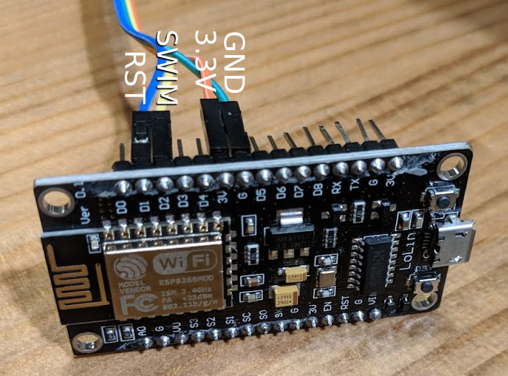
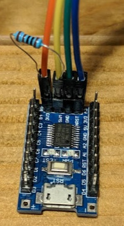

# STLINK implementation for ESP8266
This ESP8266 firmware implements the SWIM protocol for debug access / flashing
of STM8 devices.

The STM8 SWIM protocol is well documented in [UM0470](http://www.st.com/content/ccc/resource/technical/document/user_manual/ca/89/41/4e/72/31/49/f4/CD00173911.pdf/files/CD00173911.pdf/jcr:content/translations/en.CD00173911.pdf).
Communication runs @8MHz, as such the ESP (running at 80MHz) is well-suited
for bit-banging this protocol and leaves enough computing capacity for
implementing this without paying too much attention to instruction cpu
cycles.

I built this, because I was debugging a chip, clocked by a slow external clock.
Since debug access is based on the cpu’s clock rate, the SWIM module was too
slow to respond for the stlink device I had used before. Taking a look at my
logic analyzer I saw that the microcontroller indeed sent a response, but I
was unable to get it out.
Also I really don't see the point of needing a special one-purpose-only device
to flash the stm8 chips (even though they are cheap).

The timing is based on counting cpu-cycles, as such the code currently only
works if the ESP is running at 80MHz and not at 160MHz.
Only slow data transfer speed is implemented, but this shouldn’t really matter.
From what my logic analyzer told me the actual stlink device didn’t use
high-speed either.

## Building

1. Install [esp-open-sdk](https://github.com/pfalcon/esp-open-sdk)
1. `sudo apt install esptool`
1. Compile and flash

```
ESP_OPEN_SDK=/opt/esp-open-sdk
export XTENSA_TOOLS_ROOT=$ESP_OPEN_SDK/xtensa-lx106-elf/bin SDK_BASE=$ESP_OPEN_SDK/sdk flash
make flash
```

### Using a precompiled binary

Grap the latest `esp-stlink-firmware.tgz` from the releases page and flash it using:

    esptool --baud 460800 --port /dev/ttyUSB0 write_flash \
        0x00000 firmware/0x00000.bin \
        0x10000 firmware/0x10000.bin

## Connecting the ESP to STM8


* The STM8 device of course needs G and 3.3V connections.
  
* The RST line is connected to ESP8266 GPIO5 (D1 on NodeMCU).
* SWIM is connected to ESP8266 GPIO4 (e.g. D2 on NodeMCU) **via a 1kΩ pull-up
  resistor** (this is important since the builtin pullup resistor is not
  capable of pulling up the line fast enough!).
  
  > NOTE: You can likely just integrate the resistor into your wires (see the
  > attached picture) or even solder it to your ESP-board permanently.

## ESP connection to the host computer

The ESP exposes a serial interface which `stm8flash` uses to communicate with
the ESP. Typically you’ll want to use a USB-to-serial adapter.
The internet is full of tutorials on how to connect to an ESP.

If you like it simple, get a NodeMCU or WeMos development board. These work
out of the box, just connect to your computer’s USB, `make flash` and you’re
ready to use `stm8flash` with `espstlink`.

## Flashing firmware

Easiest is to use the python tool (only works with STM8S not STM8L for now):

    python3 python/flash.py -d /dev/ttyUSB0 -i sample.ihx

You need to build `libespstlink.so` first by running:

    make -C lib

## Using ESP-STLINK with stm8flash

**Note:** Older versions of stm8flash will not work with current versions, since
starting with v0.2 of espstlink the default baudrate was switched from 115200 to
921600, which allows for significantly faster flash speeds.

Grab stm8flash from https://github.com/rumpeltux/stm8flash.

    stm8flash -c espstlink -p stm8s103f3 -w sample.ihx

### Compatibility

So far this has only been tested with an stm8s103f3 chip.
It’s likely that other devices work as well, but since there may be issues
regarding timing of the wire protocol, there’s no guarantee that it’ll
work.

## Related software

[stm8spi](http://kuku.eu.org/?projects/stm8spi/stm8spi) is a related
implementation (ab)using the raspberry PI’s SPI to perform SWIM communication.
However, due to relying on SPI and its timing, it's severly limited and
wouldn't work for my use-case either.
